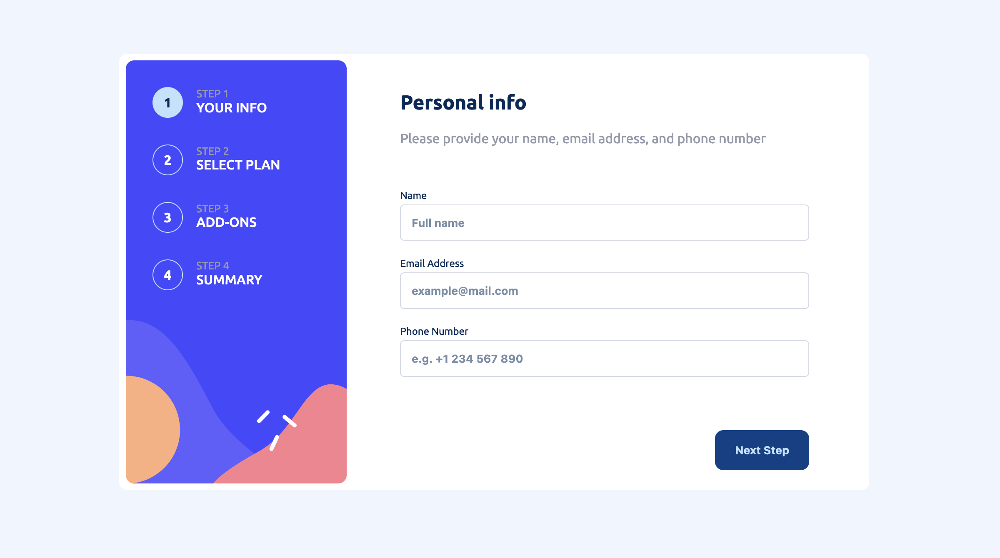

# Frontend Mentor - Multi-step form solution

This is a solution to the [Multi-step form challenge on Frontend Mentor](https://www.frontendmentor.io/challenges/multistep-form-YVAnSdqQBJ). Frontend Mentor challenges help you improve your coding skills by building realistic projects. 

## Table of contents

- [Overview](#overview)
  - [The challenge](#the-challenge)
  - [Screenshot](#screenshot)
  - [Links](#links)
- [My process](#my-process)
  - [Built with](#built-with)
  - [What I learned](#what-i-learned)
  - [Continued development](#continued-development)
  - [Useful resources](#useful-resources)
- [Author](#author)


## Overview

### The challenge

Users should be able to:

- Complete each step of the sequence
- Go back to a previous step to update their selections
- See a summary of their selections on the final step and confirm their order
- View the optimal layout for the interface depending on their device's screen size
- See hover and focus states for all interactive elements on the page
- Receive form validation messages if:
  - A field has been missed
  - The email address is not formatted correctly
  - A step is submitted, but no selection has been made

### Screenshot



### Links

- Solution URL: [repo](https://github.com/Salma-3/multi-step-form.git)
- Live Site URL: [demo](https://your-live-site-url.com)

## My process

### Built with

- Semantic HTML5 markup
- CSS custom properties
- Flexbox
- [Sass](https://sass-lang.com/)


### What I learned

I used this challenge to practice my CSS knowledge, so i didn't use any css libraries, only sass preprocessor to organize the style file better.
It's so handlful to use some ready library components in big projects, but I think its better to implement from scratch them in challenges like this one.
Here is a part of the form, where i implement switch toggle

HTML:

```html
<div class="switch-group">
  <input type="checkbox" name="term" id="switch" value="yearly"  />
  <label for="switch">
    <span class="switch-text monthly">Monthly</span>
    <span class="switch-inner"></span>
      <span class="switch-slider">
        <span class="switch-slider-inner"></span>
      </span>
    <span class="switch-text yearly">Yearly</span>
  </label>
</div>
```

CSS:

```scss
.switch-group {
        background: $magnolia;
        padding: 1rem;
        text-align: center;
        align-items: center;
        position: relative;

        label {
            display: flex;
            justify-content: center;
            width: 100%;
            height: 100%;
            gap: .8rem;
            position: relative;

            .switch-text {
                font-weight: bold;
                color: $marine-blue;

                &.yearly {
                    color: $cool-gray;
                }
            }
            
            .switch-inner {
                font-size: 1rem;
                font-weight: bold;
            }

            .switch-slider {
                background: $marine-blue;
                width: 3rem;
                height: 1.4rem;
                border-radius: 1rem;
                position: relative;

            }

            .switch-slider-inner {
                width: 1.2rem;
                height: 1.2rem;
                background: $white;
                border-radius: 50%;
                border: 1px solid $marine-blue;
                position: absolute;
                top: 2px;
                left: 3px;
                transition: transform 0.3s ease-in
            }
            
        }

        input[type=checkbox] {
            appearance: none;

            &:checked + label .switch-slider-inner {
                transform: translateX(1.5rem);
            }

            &:checked +  label .switch-text.monthly {
                color: $cool-gray;
            }
            &:checked +  label .switch-text.yearly {
                color: $marine-blue;
            }
        }

    }
```

### Continued development

I love implementing small projects like this one, but I'd like to take bigger projects for my next challenge such that I can add to the porfolio.


### Useful resources

- [MDN Web API](https://developer.mozilla.org/en-US/docs/Web/API) - I had to refer to web apis while writing JS script, as I rarly use vanilla JS.

## Author

- Frontend Mentor - [@Salma-3](https://www.frontendmentor.io/profile/Salma-3)

